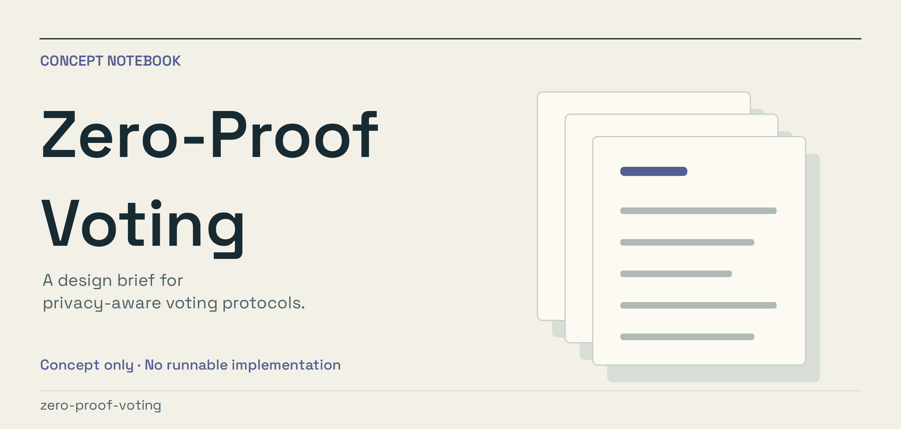
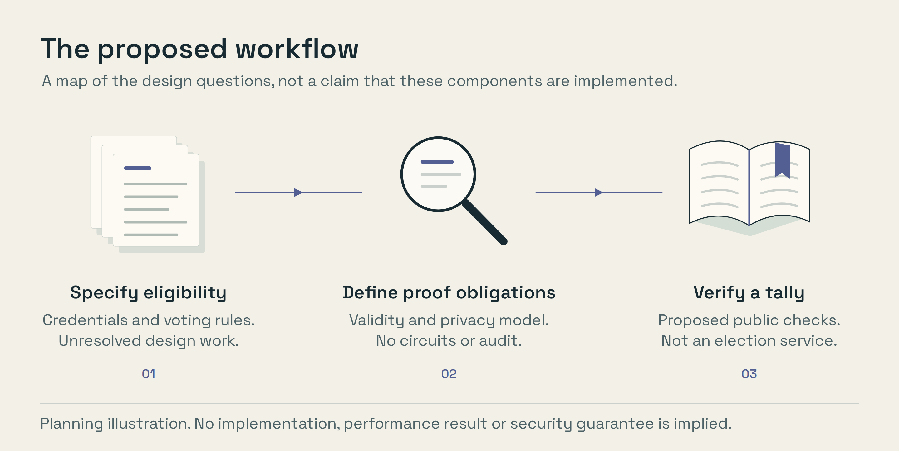

# Zero-Proof Voting

A concept for verifiable voting with configurable governance rules and zero-knowledge proofs.

**Status: concept only.** This repository is a project brief, not an available
product. Proposed components below are not implemented features.

*Conceptual illustration. [Editable artwork and render instructions](scripts/artwork/README.md).*

## What is here

A design brief. There are no circuits, proof-system parameters, contracts,
SDKs, security audits or runnable voting services in this repository. Do not
use it to conduct a real election or protect sensitive ballots.

## Proposed direction

The brief separates voter eligibility, ballot validity, tallying and result
verification. Candidate governance rules include ranked choice, quadratic
credits, delegation and weighted voting. Supporting one rule does not establish
that the others compose safely with the same proof system.

A zero-knowledge proof alone does not establish one-person-one-vote, coercion
resistance, endpoint security or a trustworthy enrollment process. The protocol
would need an explicit threat model, formal definitions and independent review
before making privacy or correctness claims.

Circom, Halo2, Noir, Rust and TypeScript are possible implementation choices,
not dependencies or evidence of an implemented cryptosystem.

## Useful feedback

Contribute a bounded protocol question, a threat-model critique, or a reference
to an existing design. Keep proposed properties separate from proven ones.
No security guarantee is made by this repository or its illustrations.
